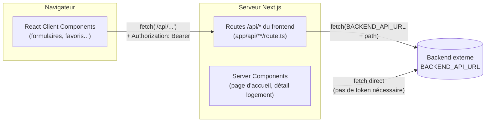
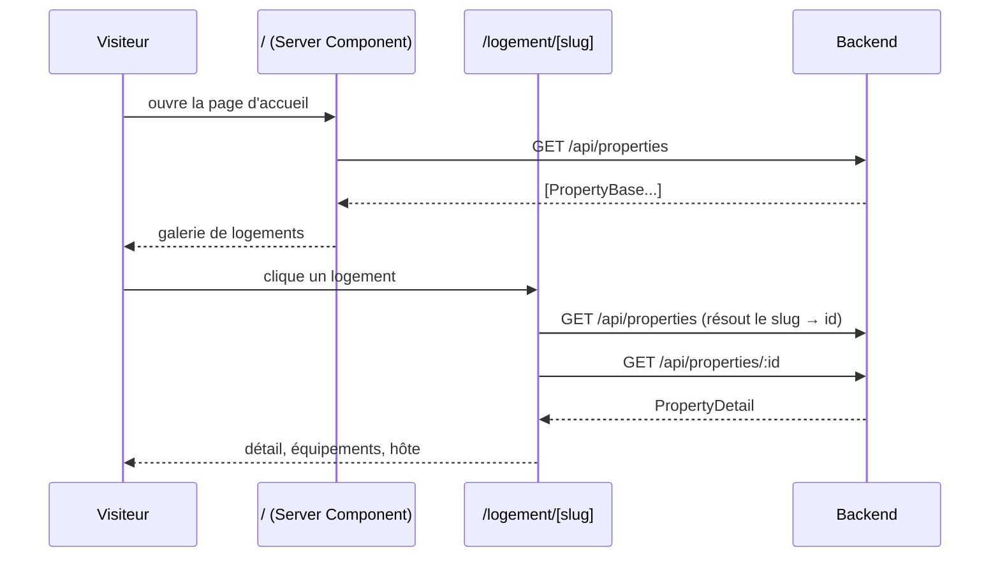
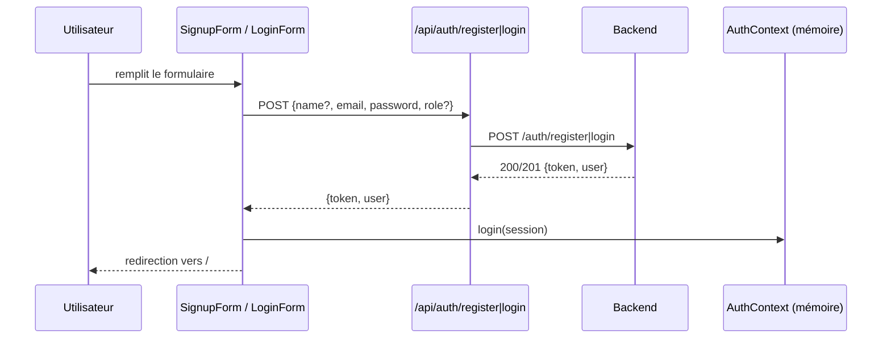
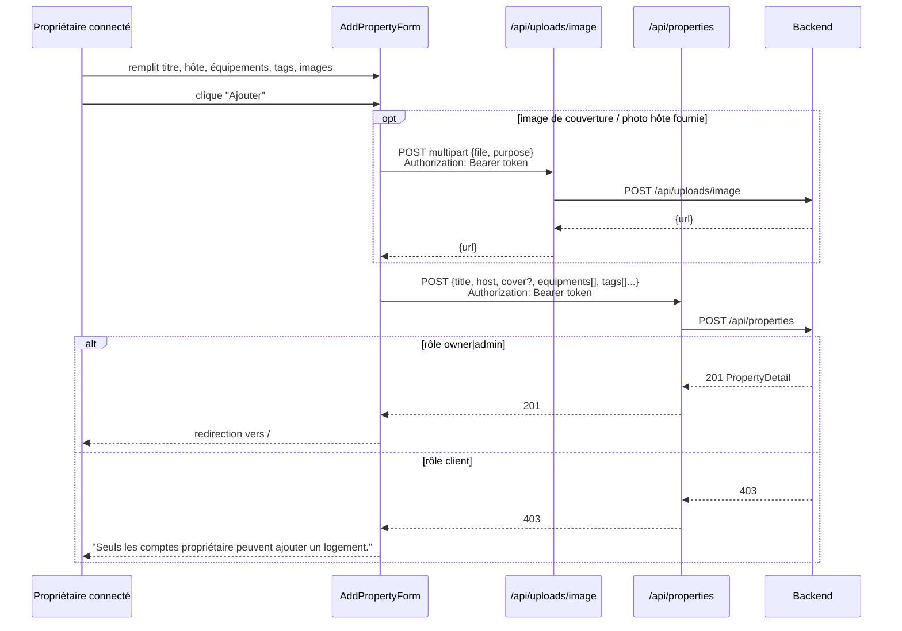
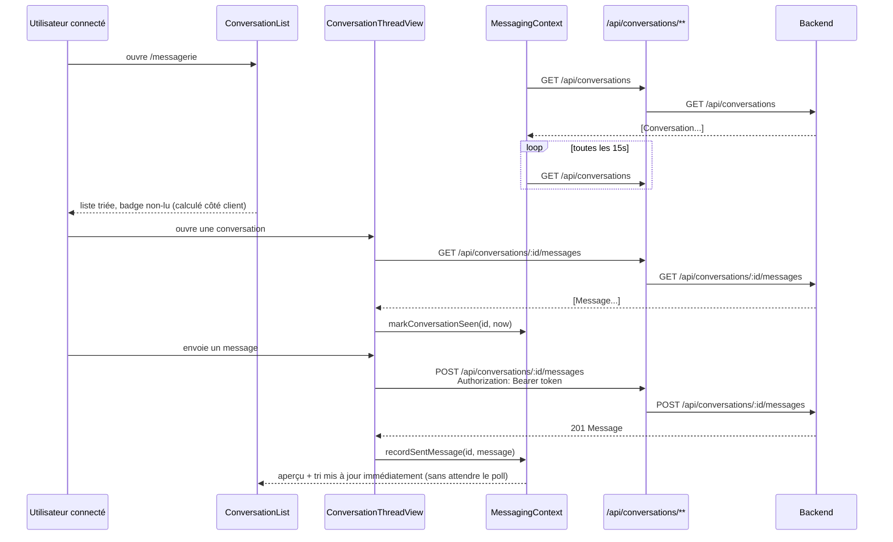

# Kasa

Clone du projet Kasa (location de logements type Airbnb), réécrit en Next.js
(App Router) sur un backend externe existant (API REST + JWT).

> Repo frontend uniquement. Le backend (Express + JWT + base de données) est
> un projet séparé, attendu sur `BACKEND_API_URL` (voir [Configuration](#configuration)).

## Stack

- **Next.js 16** (App Router, Turbopack) + React + TypeScript
- **Zod** pour valider toutes les entrées/sorties des routes proxy
- **CSS Modules** (pas de framework CSS)
- **Vitest** + **@testing-library/react** pour les tests

## Configuration

```bash
npm ci
cp .env.example .env.local   # puis renseigner BACKEND_API_URL
npm run dev
```

| Variable          | Rôle                                                                                                                                                         |
| ----------------- | ------------------------------------------------------------------------------------------------------------------------------------------------------------ |
| `BACKEND_API_URL` | Origine du backend REST (ex: `http://localhost:3000`). Lue **uniquement côté serveur** (routes `app/api/*` et Server Components) — jamais exposée au client. |

Commandes de validation (voir `AGENTS.md`) :

```bash
npm run lint    # ESLint
npm test        # Vitest
npm run build   # build de production
```

## Architecture

Le frontend ne parle **jamais directement** au backend depuis le navigateur.
Deux façons d'accéder aux données, selon où le code s'exécute :



- **Server Components** (`app/page.tsx`, `app/logement/[slug]/page.tsx` via
  `lib/data/properties.ts`) appellent le backend directement — pas besoin de
  passer par une route `/api/*` puisqu'ils tournent déjà côté serveur et que
  ces lectures ne nécessitent pas de token.
- **Client Components** (formulaires d'auth, ajout de logement) ne peuvent
  pas lire `BACKEND_API_URL` (variable serveur uniquement) : ils passent par
  les routes `app/api/**/route.ts`, qui **proxifient** vers le backend en
  forwardant le header `Authorization` et en validant le body/la réponse
  avec Zod (voir `lib/proxy/createProxyRoute.ts`, 4 factories :
  `createProxyGetRoute`, `createProxyMutationRoute` (POST/PATCH JSON),
  `createProxyMultipartRoute` (upload de fichier), `createProxyDeleteRoute`).

Tous les schémas Zod (requête + réponse) vivent dans
`lib/proxy/schemas/**`, organisés par ressource (`auth`, `properties`,
`favorites`, `uploads`, `users`, `ratings`). `lib/proxy/schemas/API_ROUTES.md`
documente le contrat complet du backend (routes, auth requise, rôles,
formats d'erreur) — **source de vérité** à consulter avant de brancher une
nouvelle route.

### Authentification

`lib/auth/AuthContext.tsx` garde la session (`{token, user}`) **en mémoire
uniquement** — pas de `localStorage`/cookie, donc un rechargement de page
déconnecte l'utilisateur. Choix assumé pour éviter qu'un token soit
exfiltrable via XSS/localStorage ; à remplacer par un mécanisme persistant
(cookie httpOnly côté backend, par ex.) si l'UX doit survivre au F5.

`components/auth/RequireAuth.tsx` protège une page côté client : redirige
vers `/login` si `isAuthenticated` est faux. Il ne vérifie **que**
l'authentification, pas le rôle — voir [Rôles](#rôles-utilisateur).

### Rôles utilisateur

Le backend connaît 3 rôles : `client`, `owner`, `admin`. Seuls `owner` et
`admin` peuvent créer/modifier/supprimer un logement ou uploader une image
(`requireRole(['owner','admin'])` côté backend → `403` sinon). À
l'inscription (`SignupForm`), une case "Je veux louer mon logement" envoie
`role: 'owner'`, sinon `role: 'client'` par défaut.

⚠️ Le rôle est encodé **dans le JWT** au moment du login/register — le
changer en base (`PATCH /api/users/:id`) ne change rien pour une session
déjà ouverte tant que l'utilisateur ne se reconnecte pas (vérifié
empiriquement). Il n'y a donc pas de "promotion" transparente possible sans
réémettre un token.

## Flux types

### 1. Visiteur découvre un logement



Aucune authentification requise pour ce parcours.

### 2. Inscription / connexion



### 3. Ajout d'un logement (propriétaire)



`RequireAuth` (dans `app/logement/ajouter/page.tsx`) bloque déjà les
visiteurs non connectés en amont (redirection `/login`), mais ne filtre pas
par rôle : un compte `client` arrive jusqu'au formulaire et n'est bloqué
qu'à la soumission (cf. finding ci-dessus sur les rôles).

### 4. Consultation et envoi de messages



`MessagingProvider` (voir `lib/messaging/MessagingContext.tsx`) n'est monté
que sous `app/messagerie/layout.tsx` — pas dans le layout racine — donc rien
en dehors de `/messagerie` (y compris le Navbar) ne peut lire
`unreadCount` : c'est un choix de scope assumé, pas un oubli, mais à savoir
si un badge de non-lus est prévu ailleurs dans l'UI un jour. Le statut
lu/non-lu est une approximation **client uniquement** (comparaison de
timestamps stockée en `localStorage`, pas de flag côté backend) — elle ne
survit pas à un `localStorage.clear()` et ne se synchronise pas entre
appareils.
